### **简介**

为Pyauto-Script提供可视化界面，快捷的生成截图以及点击信息。

### **功能**

1. 打开process（就是一个文件夹）
2. 新建截图，让用户选择窗口，返回窗口截图
3. 界面显示截图
4. 用户可以在截图上绘制一个矩形框（称模板），坐标(x1, y1, x2, y2)，下面显示模板信息
5. 截图下面显示的且可填写的信息：
   1. 【delay time】绝对点击时间：匹配上后多久点击（绝对时间ms）。
      default: 500
   2. 【random delay time】点击时间随机延迟量：过了绝对点击时间后，随机延迟多久时间（ms）。
      default: 100 
   3. 【relative click position】要点击的相对与目标窗口的绝对位置坐标 如：Rcp100x200 width x height
      auto-generated: ${x1}x${y1}
   4. 【random right offset】右侧随机偏移量
      auto-generated: ${x2 - x1}
   5. 【random bottom offset】下侧随机偏移量
      auto-generated: ${y2 - y1}
   6. 【delay up time】鼠标单机按下(down)之后，多久ms后抬起(up)
      default: 50
   7. 【delay random up time】在delay up time 基础上，再随机延迟多久
      default: 30
   8. 【random offset when up】鼠标down 与 up 期间，随机向各个角度的偏移量，一般几个像素点
      default: 3
   9. 【loop least count】至少循环点击几次
      default: 1
   10. 【loop random count】额外随机点击次数 
       default: 0
   11. 【loop delay least time】每次随机点击结束后的延迟时间
       default: 500
   12. 【loop delay random time】每次随机点击结束后的延迟时间后，额外延迟时间
       default: 200
   13. 【end delay least time】当点击完后，至少多久不再去匹配模板 (ms)
       default: 1000
   14. 【end delay random time】额外等待随机时间ms
       default: 500
   15. 【threshold】匹配阈值，大于该值时，触发点击事件，范围 0 - 100
       default: 90
   16. 【use matching position】 还是该文件名定义的坐标 #1；使用截图上匹配到的图片坐标 #2
       default: 1
   17. 【match event】匹配上后的事件：自定义函数，函数须与当前图片同一文件夹，且函数文件名为：函数名.py
       default: None
   18. 【finish event】所有操作都执行完后的事件：自定义函数，函数须与当前图片同一文件夹，且函数文件名为：函数名.py
       default: None

点击adb mode 闪退问题：
    * 由于缺少 【AdbWinApi.dll】
        * 将【AdbWinApi.dll】放置到 C:\Windows\SysWOW64 目录下，即可解决

### **软件界面**

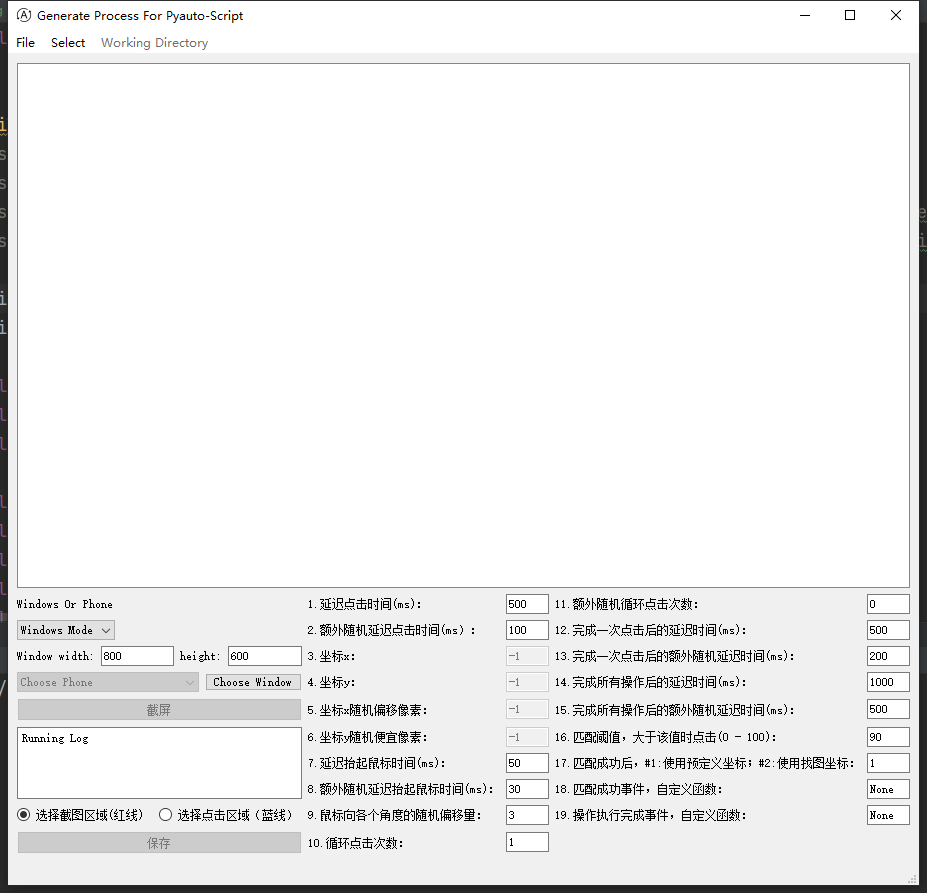

### **软件使用**

#### 1、选择一个存放process的文件夹

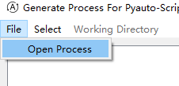

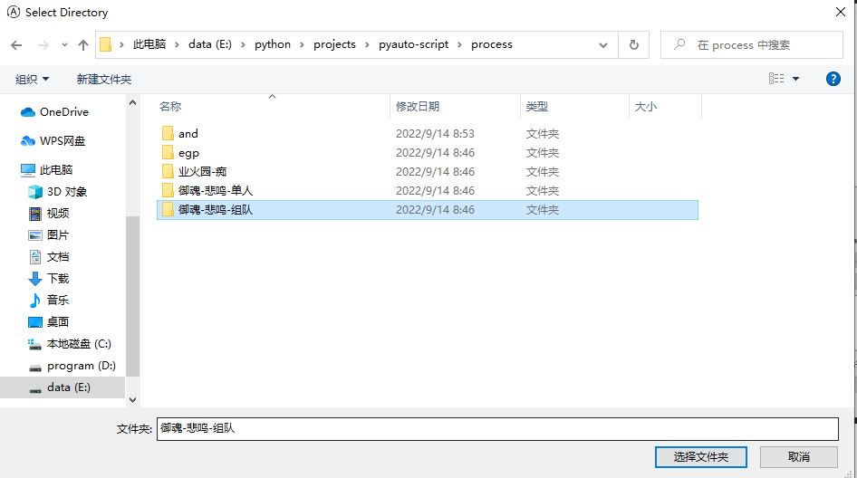

#### 2、选择windows还是连接手机

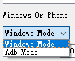

##### 2.1、当选择Windows Mode

1. 填写窗口的width，height，之后点击choose window选择窗口

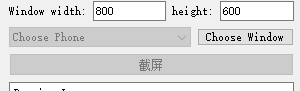

2. 选择窗口后，窗口会被自动缩放成指定尺寸

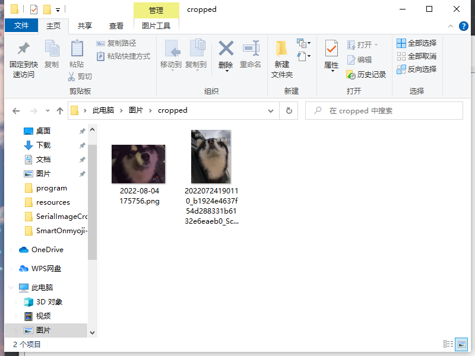

##### 2.2、当选择Adb Mode

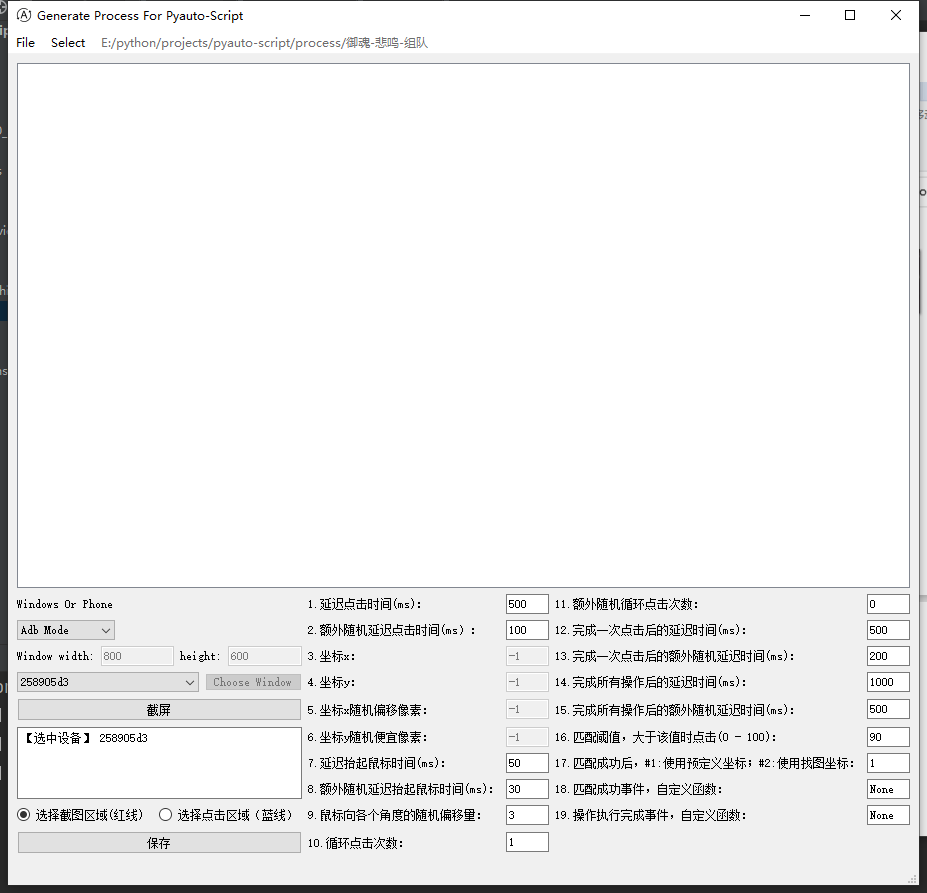

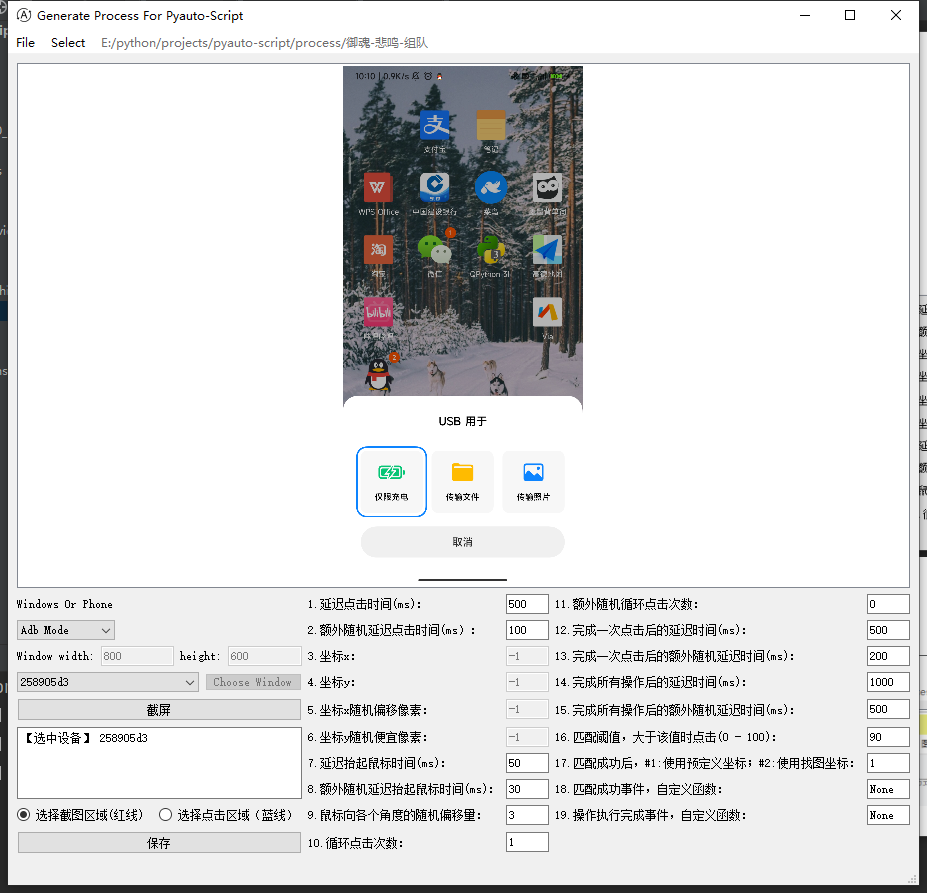

#### 3、点击截屏，截取窗口图片

#### 4、选取连个区域，红框为裁剪图像的范围，蓝框为鼠标随机点击的范围

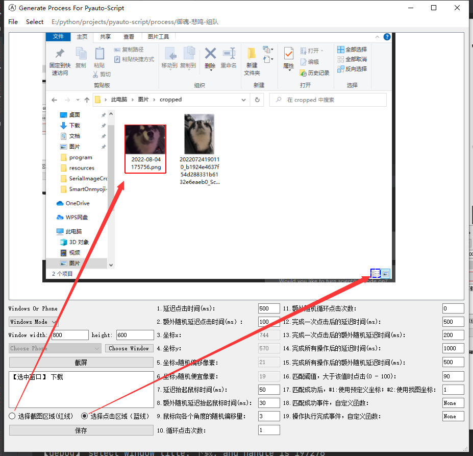

#### 5、填写点击的参数

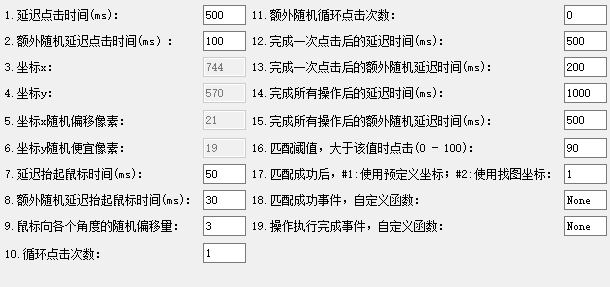

#### 6、最后保存

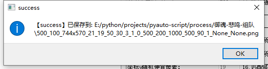

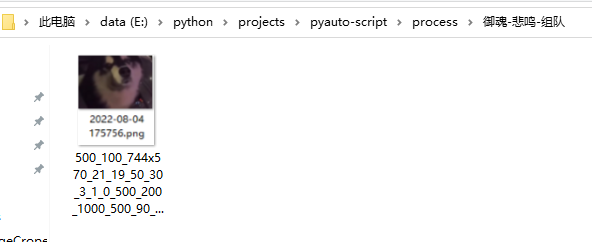

